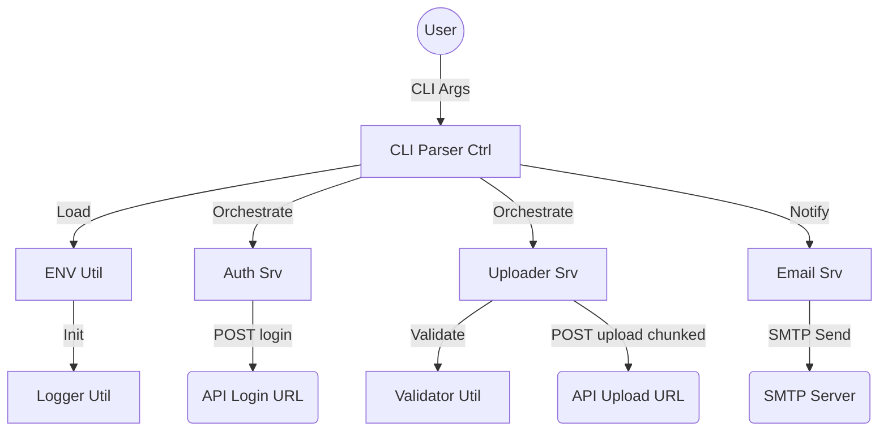

# JSON Uploader (C++23)

CLI application designed for streaming large JSON files to a REST API

---

<!-- START doctoc generated TOC please keep comment here to allow auto update -->
<!-- DON'T EDIT THIS SECTION, INSTEAD RE-RUN doctoc TO UPDATE -->
**Table of Contents**

- [Description](#description)
  - [Key Features:](#key-features)
- [Configuration](#configuration)
  - [Environment File (`json_upload.env`)](#environment-file-json_uploadenv)
- [Usage](#usage)
- [Architecture](#architecture)
  - [Bounded Context Diagram](#bounded-context-diagram)
- [📄 License](#-license)
- [🤝 Authors](#-authors)
  - [Code Contributors](#code-contributors)

<!-- END doctoc generated TOC please keep comment here to allow auto update -->

---

## Description

This tool is a high-performance CLI application designed for streaming large JSON files to a REST API.

### Key Features:

- **Modern C++23**: Utilizes `std::expected`, `std::print`, and monadic operations for robust and efficient code.
- **Compliance**: Strict file naming conventions (`_srv`, `_util`, `_type`, `_ctrl`), Doxygen headers, and structured project layout.
- **Flexible Configuration**: Supports loading environment variables from a `json_upload.env` file or system environment.
- **Advanced Logging**: Uses `spdlog` with daily rotation and configurable log paths.
- **High-Performance Streaming**:
  - **simdjson**: Extremely fast parsing of JSON documents.
  - **valijson**: Precise schema validation before transmission.
  - **zstd**: Optional on-the-fly compression to minimize bandwidth.
  - **libcurl**: Chunked HTTPS upload starting as soon as the first object is processed.
- **Robust JSON Formatting**: Automatically wraps multiple objects or input arrays into a single, valid JSON array for maximum server compatibility.
- **Email Notifications**: Direct status reporting via SMTP with STARTTLS support.

## Configuration

### Environment File (`json_upload.env`)

Default path: `<program_dir>/../data/json_upload.env`. Can be overridden via `--env <path>`.

Example content:

```env
API_LOGIN_URL=https://api.example.com/login
API_UPLOAD_URL=https://api.example.com/upload
API_USER=admin
API_PASSWORD=change_me
API_COMPRESSION=false
API_EMAIL=alerts@example.com
SMTP_SERVER=smtp.example.com
SMTP_PORT=587
SMTP_USER=user@example.com
SMTP_PASSWORD=password
SMTP_FROM=noreply@example.com
SMTP_STARTTLS=true
LOG_PATH=./logs
```

## Usage

```bash
./json_uploader --json data.json --schema schema.json --email
```

Optional arguments:

- `--env <path>`: Load a specific environment configuration file.
- `--email`: Enable email notification after completion.

## Architecture

The architecture follows the Service-Provider pattern with a clear separation between types, utilities, and services. For detailed diagrams and data flow information, please refer to [docs/architecture/overview.md](docs/architecture/overview.md).

### Bounded Context Diagram



## 📄 License

This project is licensed under the **Apache License 2.0**.

Copyright (c) 2026 ZHENG Robert

## 🤝 Authors

- [](https://www.github.com/Zheng-Bote)

### Code Contributors


[](https://www.github.com/Zheng-Bote)

---

:vulcan_salute:
