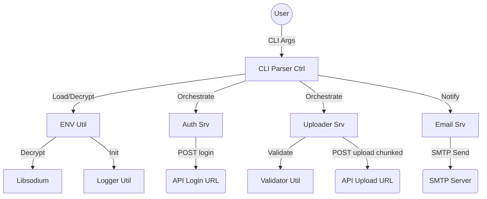

<div id="top" align="center">
<h1>JSON Uploader</h1>

<p>CLI application designed for streaming large JSON files to a REST API.</p>


[](https://github.com/Zheng-Bote/json_uploader/releases)
<br/>
[Report Issue](https://github.com/Zheng-Bote/json_uploader/issues) · [Request Feature](https://github.com/Zheng-Bote/json_uploader/pulls)

</div>

---

<!-- START doctoc generated TOC please keep comment here to allow auto update -->
<!-- DON'T EDIT THIS SECTION, INSTEAD RE-RUN doctoc TO UPDATE -->

**Table of Contents**

- [Description](#description)
  - [Key Features:](#key-features)
- [Dependencies](#dependencies)
  - [System Requirements (Ubuntu example)](#system-requirements-ubuntu-example)
  - [Build Instructions](#build-instructions)
    - [1. Configure Conan Profile](#1-configure-conan-profile)
    - [2. Install Dependencies](#2-install-dependencies)
    - [3. Configure and Build](#3-configure-and-build)
  - [Libraries managed via Conan](#libraries-managed-via-conan)
- [Documentation](#documentation)
- [Configuration](#configuration)
  - [Environment File (`json_uploader.env`)](#environment-file-json_uploaderenv)
- [Usage](#usage)
  - [Options:](#options)
- [Architecture](#architecture)
  - [Bounded Context Diagram](#bounded-context-diagram)
- [📄 License](#-license)
- [🤝 Authors](#-authors)

<!-- END doctoc generated TOC please keep comment here to allow auto update -->

---

## Description


This tool is a high-performance CLI application designed for streaming large JSON files to a REST API. It handles multi-gigabyte files efficiently by using streaming techniques and modern compression.

### Key Features:

- **Modern C++23**: Utilizes `std::expected`, `std::print`, and monadic operations for robust and efficient code.
- **Compliance**: Strict file naming conventions (`_srv`, `_util`, `_type`, `_ctrl`), Doxygen headers, and structured project layout.
- **Security**: Supports **encrypted `.env` files** using `libsodium` (XChaCha20-Poly1305).
- **Flexible Configuration**: Integrated `dotenv-cpp` for environment variable management with system-level override priority.
- **Advanced Logging**: Uses `spdlog` with dynamic log levels (`trace` to `off`) and daily rotation.
- **High-Performance Streaming**:
  - **simdjson**: Extremely fast parsing of JSON documents.
  - **valijson**: Precise schema validation before transmission.
  - **Multiple Compression Modes**: Supports **Zstd**, **Gzip**, and uncompressed uploads.
  - **libcurl**: Chunked HTTPS upload starting as soon as the first object is processed.
- **Metadata Support**: Automatically extracts environment variables starting with `META_`. Behavior is controlled by `API_META=<none|object|single>` (Default: `object`).
  - `none`: No metadata added.
  - `object`: Metadata merged into a `metadata` object field.
  - `single`: Metadata merged as top-level attributes into each JSON object.
- **Robust JSON Formatting**: Automatically wraps multiple objects or input arrays into a single, valid JSON array for maximum server compatibility.
- **Email Notifications**: Direct status reporting via SMTP with STARTTLS support.

## Dependencies

The project requires a C++23 compatible compiler (e.g., GCC 15+) and uses **Conan v2** for dependency management.

### System Requirements (Ubuntu example)

To install the basic build tools:

```bash
sudo apt-get update
sudo apt-get install -y build-essential cmake git pkg-config pip
pip install "conan>=2.0"
```

### Build Instructions

The project uses Conan v2 with the `cmake_layout` and `CMakeToolchain`.

#### 1. Configure Conan Profile

Ensure your Conan profile is set to C++23:

```bash
conan profile detect --force
conan profile update settings.compiler.cppstd=23 default
```

#### 2. Install Dependencies

This will download and build all required libraries (static by default) into the `build` directory:

```bash
conan install . --output-folder=build --build=missing -s compiler.cppstd=23
```

#### 3. Configure and Build

Use the generated toolchain file to configure CMake:

```bash
cd build
cmake .. -DCMAKE_TOOLCHAIN_FILE=build/Release/generators/conan_toolchain.cmake -DCMAKE_BUILD_TYPE=Release
cmake --build . -j"$(nproc)"
```

### Libraries managed via Conan

The following libraries are handled automatically:

- **libcurl**, **zlib**, **simdjson**, **zstd**, **nlohmann_json**, **spdlog**, **valijson**, **libsodium**.

**Note**: `dotenv-cpp` is currently fetched directly via CMake `FetchContent`.

## Documentation

The project documentation is structured to provide clear insights for developers and users:

- **Architecture**: Detailed design patterns and diagrams are located in [docs/architecture/overview.md](docs/architecture/overview.md).
- **API/Code**: Doxygen-style comments are used throughout the source code.
- **Changelog**: Evolution of the project is tracked in [CHANGELOG.md](CHANGELOG.md).

## Configuration

### Environment File (`json_uploader.env`)

Default path: `<program_dir>/../data/json_uploader.env`. Can be overridden via `--env <path>`.

Example content:

```env
# JSON Uploader Configuration
# Author: ZHENG Robert
# Date: 2026-03-29

# API Configuration
API_LOGIN_URL=https://api.example.com/login
API_UPLOAD_URL=https://api.example.com/upload
API_USER=admin
API_PASSWORD=change_me
# Compression: zstd, gzip, none
API_COMPRESSION=zstd
# Metadata behavior: object, single, none
API_META=object

# Email Notification
API_EMAIL=api.alerts@myemail.com
SMTP_SERVER=smtp.googlemail.com
SMTP_PORT=587
SMTP_USER=api.admin@myemail.com
SMTP_PASSWORD=topsecret
SMTP_FROM=api.admin@myemail.com
SMTP_STARTTLS=true

# Logging
LOG_PATH=data/logs
LOG_LEVEL=Info

META_environment=production
META_region=eu-central-1
META_DEBUG=yes
```

## Usage

```bash
./json_uploader --json data.json --schema schema.json [options]
```

### Options:

- `--json <path>`: (Required) Path to the JSON file to upload.
- `--schema <path>`: (Required) Path to the JSON schema for validation.
- `--env <path>`: Load a specific environment configuration file.
- `--encrypted`: Enable decryption of the `.env` file before parsing.
- `--env-pass-var <name>`: Environment variable name containing the decryption password (Default: `ENV_PASS`).
- `--email`: Enable email notification after completion.

## Architecture

The architecture follows the Service-Provider pattern. For detailed diagrams, please refer to [docs/architecture/overview.md](docs/architecture/overview.md).

### Bounded Context Diagram



## 📄 License

This project is licensed under the **Apache License 2.0**.

Copyright (c) 2026 ZHENG Robert

## 🤝 Authors

- [](https://www.github.com/Zheng-Bote)

---

:vulcan_salute:

<p align="right">(<a href="#top">back to top</a>)</p>
