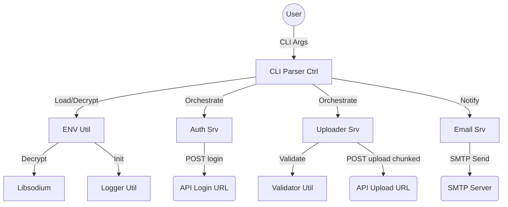

# JSON Uploader (C++23)

CLI application designed for streaming large JSON files to a REST API.

---

<!-- START doctoc -->
<!-- END doctoc -->

---

## Description

This tool is a high-performance CLI application designed for streaming large JSON files to a REST API. It handles multi-gigabyte files efficiently by using streaming techniques and modern compression.

### Key Features:

- **Modern C++23**: Utilizes `std::expected`, `std::print`, and monadic operations for robust and efficient code.
- **Compliance**: Strict file naming conventions (`_srv`, `_util`, `_type`, `_ctrl`), Doxygen headers, and structured project layout.
- **Security**: Supports **encrypted `.env` files** using `libsodium` (XChaCha20-Poly1305).
- **Flexible Configuration**: Integrated `dotenv-cpp` for environment variable management with system-level override priority.
- **Advanced Logging**: Uses `spdlog` with dynamic log levels (`trace` to `off`) and daily rotation.
- **High-Performance Streaming**:
  - **simdjson**: Extremely fast parsing of JSON documents.
  - **valijson**: Precise schema validation before transmission.
  - **Multiple Compression Modes**: Supports **Zstd**, **Gzip**, and uncompressed uploads.
  - **libcurl**: Chunked HTTPS upload starting as soon as the first object is processed.
- **Metadata Support**: Automatically extracts environment variables starting with `META_` and merges them into the `metadata` field of each uploaded JSON object.
- **Robust JSON Formatting**: Automatically wraps multiple objects or input arrays into a single, valid JSON array for maximum server compatibility.
- **Email Notifications**: Direct status reporting via SMTP with STARTTLS support.

## Documentation

The project documentation is structured to provide clear insights for developers and users:

- **Architecture**: Detailed design patterns and diagrams are located in [docs/architecture/overview.md](docs/architecture/overview.md).
- **API/Code**: Doxygen-style comments are used throughout the source code.
- **Changelog**: Evolution of the project is tracked in [CHANGELOG.md](CHANGELOG.md).

## Configuration

### Environment File (`json_uploader.env`)

Default path: `<program_dir>/../data/json_uploader.env`. Can be overridden via `--env <path>`.

Example content:

```env
# API Configuration
API_LOGIN_URL=https://api.example.com/login
API_UPLOAD_URL=https://api.example.com/upload
API_USER=admin
API_PASSWORD=change_me

# Compression: zstd, gzip, none
API_COMPRESSION=zstd

# Logging
LOG_PATH=data/logs
LOG_LEVEL=Info

# Metadata (will be added to each JSON object)
META_environment=production
META_region=eu-central-1

# Email Notification
API_EMAIL=api.alerts@example.com
SMTP_SERVER=smtp.example.com
SMTP_PORT=587
SMTP_USER=api.admin@example.com
SMTP_PASSWORD=topsecret
SMTP_FROM=api.admin@example.com
SMTP_STARTTLS=true
```

## Usage

```bash
./json_uploader --json data.json --schema schema.json [options]
```

### Options:

- `--json <path>`: (Required) Path to the JSON file to upload.
- `--schema <path>`: (Required) Path to the JSON schema for validation.
- `--env <path>`: Load a specific environment configuration file.
- `--encrypted`: Enable decryption of the `.env` file before parsing.
- `--env-pass-var <name>`: Environment variable name containing the decryption password (Default: `ENV_PASS`).
- `--email`: Enable email notification after completion.

## Architecture

The architecture follows the Service-Provider pattern. For detailed diagrams, please refer to [docs/architecture/overview.md](docs/architecture/overview.md).

### Bounded Context Diagram



## 📄 License

This project is licensed under the **Apache License 2.0**.

Copyright (c) 2026 ZHENG Robert

## 🤝 Authors

- [](https://www.github.com/Zheng-Bote)

---

:vulcan_salute:
