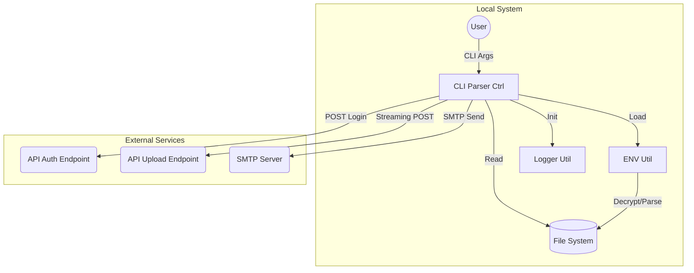
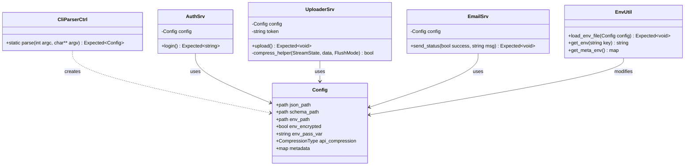
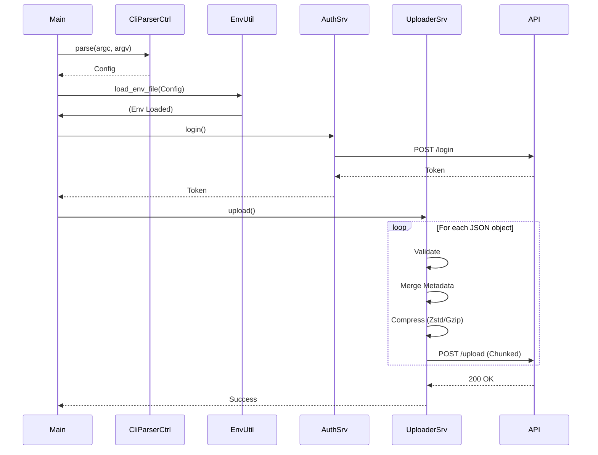
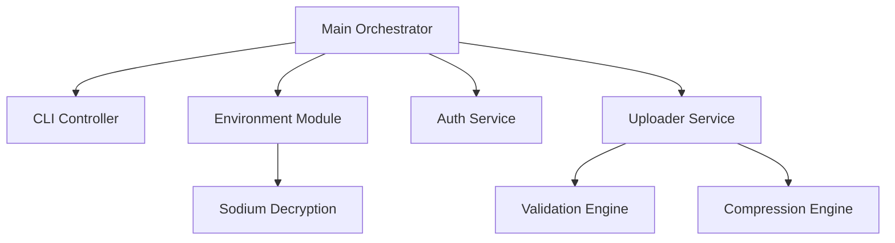

# Architectural Overview - JSON Uploader

This document provides a detailed overview of the system architecture, design patterns, and data flow within the JSON Uploader project.

---

<!-- START doctoc generated TOC please keep comment here to allow auto update -->
<!-- DON'T EDIT THIS SECTION, INSTEAD RE-RUN doctoc TO UPDATE -->
**Table of Contents**

- [Design Patterns](#design-patterns)
- [Diagrams](#diagrams)
  - [1. Bounded Context & Interfaces](#1-bounded-context--interfaces)
  - [2. Class Diagram](#2-class-diagram)
  - [3. Sequence Diagram: Upload Workflow](#3-sequence-diagram-upload-workflow)
  - [4. Component Diagram](#4-component-diagram)
- [Data Flow](#data-flow)

<!-- END doctoc generated TOC please keep comment here to allow auto update -->

---

## Design Patterns

- **Service-Provider Pattern**: Core business logic is encapsulated in services (`AuthSrv`, `UploaderSrv`, `EmailSrv`).
- **Controller Pattern**: CLI parsing and main workflow orchestration are handled by controllers (`CliParserCtrl`).
- **Utility Pattern**: Reusable, stateless logic is implemented in utility modules (`EnvUtil`, `LoggerUtil`, `ValidatorUtil`).
- **Streaming Architecture**: Uses a callback-driven approach for data processing to handle large files without excessive memory consumption.

## Diagrams

### 1. Bounded Context & Interfaces

This diagram illustrates the external interfaces and the main functional boundaries of the application.

### 2. Class Diagram

### 3. Sequence Diagram: Upload Workflow

### 4. Component Diagram

## Data Flow

1.  **Configuration Phase**: CLI arguments are parsed into a `Config` object.
2.  **Environment Phase**: The `.env` file is loaded. If encrypted, `libsodium` is used for in-memory decryption.
3.  **Authentication Phase**: Credentials from the environment are used to obtain a Bearer Token.
4.  **Upload Phase**:
    - The JSON file is read as a stream using `simdjson`.
    - Each object is validated against the schema.
    - Environment variables prefixed with `META_` are merged into the object's `metadata` field.
    - The object is compressed using the configured algorithm (Zstd or Gzip).
    - Data is sent to the API via chunked transfer encoding.
5.  **Notification Phase**: If enabled, an email is sent with the final status.
