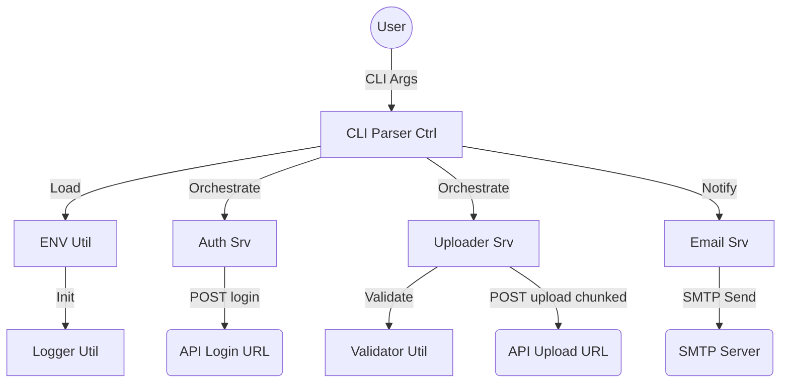
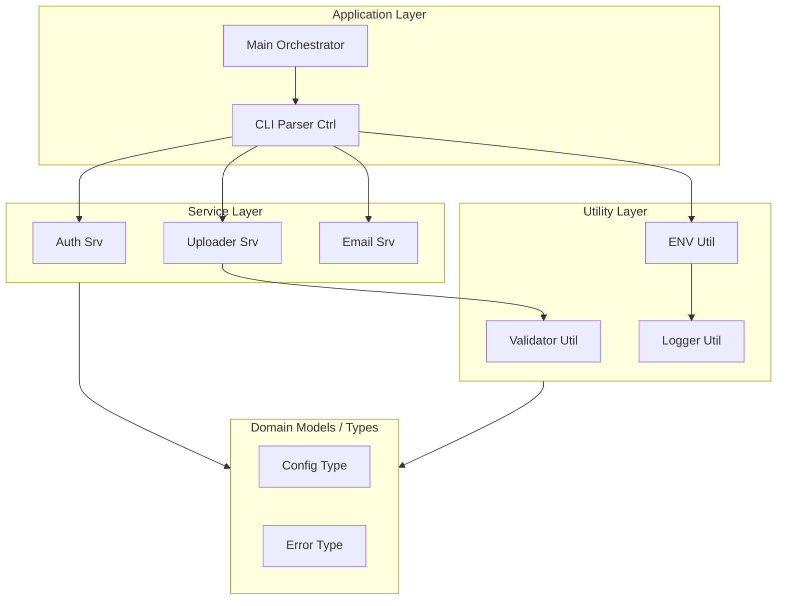

# Architecture Documentation - JSON Uploader

<!-- DOCTOC SKIP -->

## Overview

The JSON Uploader is a high-performance C++23 CLI tool designed for streaming large JSON files to a REST API. It combines iterative parsing, schema validation, optional compression, and automated SMTP notifications.

## Components

### Bounded Context Diagram

### Component Diagram

## Data Flow & Processing

### 1. Initialization

- **CLI Parsing**: The command line arguments are processed to determine file paths and modes.
- **Environment**: The `ENV Util` loads configuration from `data/json_upload.env`.
- **Logging**: A daily rotating `spdlog` instance is initialized.

### 2. Authentication

- The `Auth Srv` performs a `POST` request to `API_LOGIN_URL` with the payload `{"user": "...", "password": "..."}`.
- Upon success, a Bearer Token is extracted from the JSON response.

### 3. Streaming Upload

- **Input Processing**: `simdjson` is used to iterate through the input file. It supports both top-level arrays and concatenated JSON objects (JSON-L).
- **Validation**: Each individual object is validated against the provided JSON schema using `Validator Util`.
- **Transformation**: To ensure server compatibility, the tool flattens all inputs and wraps them into a **single JSON array** (`[...]`), with elements separated by commas.
- **Compression**: If `API_COMPRESSION` is enabled, chunks are compressed on-the-fly using `zstd`.
- **Transmission**: `libcurl` handles the `HTTP/1.1 Chunked Transfer Encoding` upload to `API_UPLOAD_URL`.

### 4. Notification

- After the workflow finishes (successfully or with an error), the `Email Srv` sends a status report via SMTP.
- Support for `STARTTLS` ensures secure communication with the mail server.

## Modern C++23 Implementation

- **std::expected<T, E>**: Primary error handling mechanism to avoid exceptions in performance-critical paths.
- **std::print / std::println**: Used for high-performance console output.
- **Monadic Operations**: `.and_then()` and `.or_else()` are used to chain service calls elegantly.
- **Platform Agnostic**: Designed to run on Linux and Windows (via `_putenv_s` for environment management).

## Performance Optimization

- **Memory Footprint**: The application never loads the entire JSON file into RAM. It processes one object at a time.
- **CPU Efficiency**: Leveraging `simdjson`'s SIMD instructions and `zstd`'s streaming API for maximum throughput.
- **Real-time Streaming**: Data is flushed to the network as soon as a chunk is ready, reducing overall latency.
